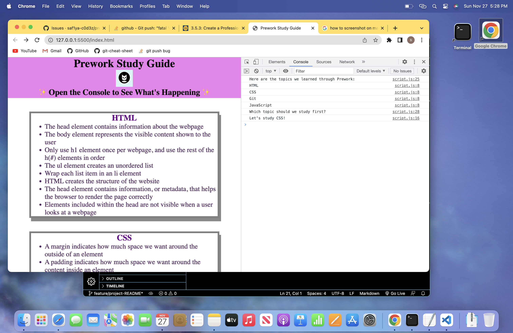

# Prework Study Guide Webpage

## Description

Bootcamp can be filled with information so, The Prework Study Guide webpage was made to help students organize the abundance of information they learn.
This website will help busy students organize their notes for studying and easy future reference
It solves the problem of forgetting information learned and having messy unorganized notes, also the notes are easily accesible from any location as they can be pulled up in a web browser.
I learned how to code a webpage using HTML, CSS and JavaScript, how to build the structure of a webpage, style the webpage, and make it interactive using variables, if else statements and functions.
This project stands out because this is the first project I completed.

## Installation

N/A

## Usage

To use this website all you need to do in open the console. In the console the user can view the topics we learned in the bootcamp prework. A random topic will also be generated in the console so the user or bootcamp student can have a topic to study for that day or study session. The user can also view notes of HTML, CSS, Git and JavaScript in a organized bulleted list to review and learn information from the prework in bootcamp on the website itself.

## Credits

N/A

## License

Copyright (c) 2022 saf1ya-c0d3z

Permission is hereby granted, free of charge, to any person obtaining a copy
of this software and associated documentation files (the "Software"), to deal
in the Software without restriction, including without limitation the rights
to use, copy, modify, merge, publish, distribute, sublicense, and/or sell
copies of the Software, and to permit persons to whom the Software is
furnished to do so, subject to the following conditions:

The above copyright notice and this permission notice shall be included in all
copies or substantial portions of the Software.

THE SOFTWARE IS PROVIDED "AS IS", WITHOUT WARRANTY OF ANY KIND, EXPRESS OR
IMPLIED, INCLUDING BUT NOT LIMITED TO THE WARRANTIES OF MERCHANTABILITY,
FITNESS FOR A PARTICULAR PURPOSE AND NONINFRINGEMENT. IN NO EVENT SHALL THE
AUTHORS OR COPYRIGHT HOLDERS BE LIABLE FOR ANY CLAIM, DAMAGES OR OTHER
LIABILITY, WHETHER IN AN ACTION OF CONTRACT, TORT OR OTHERWISE, ARISING FROM,
OUT OF OR IN CONNECTION WITH THE SOFTWARE OR THE USE OR OTHER DEALINGS IN THE
SOFTWARE.

